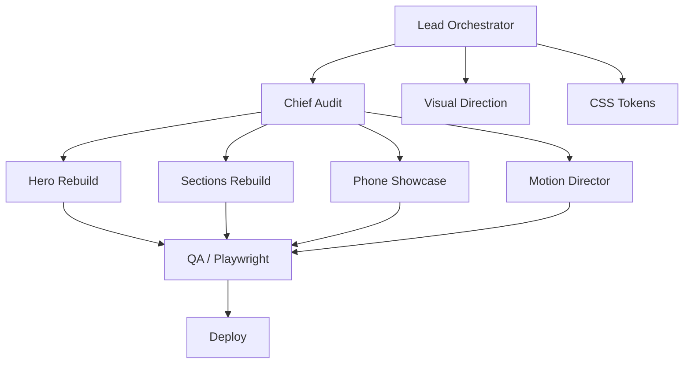

# Smart Menu Visual Overhaul — Black/White/Gold Cinematic Redesign

**Date:** 2026-06-26
**Target ref:** refrence2.png (black/gold detailed landing mockup)
**Deploy:** Live Vercel (smart-menu-sigma.vercel.app)
**Mode:** Full agent swarm with ultracode orchestration

---

## 1. Visual Direction

### Brand DNA (revised)
- **Cool · Premium · Trusted** → **Luxurious · Minimal · Confident**
- Arabic-first Saudi restaurant menu SaaS
- Target feel: calm, expensive, spacious, gold-accented

### Color System (blue purge + gold only)

**Rule: Zero blue anywhere.** Delete every blue shade, gradient, token, and Tailwind class from ALL landing files.

- Purge: `--color-blue-50..900`, `--gradient-blue`, `--gradient-brand`, `blue-*` classes, `text-blue-*`, `bg-blue-*`, `border-blue-*`, `from-blue-*`, `to-blue-*`, `ring-blue-*`, `focus:border-blue-*`, `text-gradient-animated`
- PURGE in: `globals.css`, `DESIGN.md`, `src/components/landing/*`, `src/components/ui/*`, `src/app/globals.css`, `src/app/admin/**/*.css`

| Token | Light | Dark | Usage |
|-------|-------|------|-------|
| `--primary` | `oklch(0.65 0.18 85)` | `oklch(0.72 0.18 85)` | CTAs, dividers, accents |
| `--primary-foreground` | `oklch(0.98 0 0)` | `oklch(0.07 0 0)` | Text on gold |
| `--gold` | `oklch(0.65 0.18 85)` | `oklch(0.72 0.18 85)` | GOLD semantic alias |
| `--gold-muted` | `oklch(0.65 0.18 85 / 0.15)` | `oklch(0.72 0.18 85 / 0.2)` | Subtle gold bg |
| `--background` | `oklch(1 0 0)` | `oklch(0.07 0.01 85)` | Page bg |
| `--foreground` | `oklch(0.07 0 0)` | `oklch(0.93 0.01 85)` | Body text |

- Add: gold scale tokens (50-900)
- All component colors inherit from tokens — no hardcoded colors

### Typography
- Display: **Readex Pro** (600 weight, -0.02em letter-spacing, `text-wrap: balance`)
- Body: **Noto Sans Arabic** (400 weight, 1.7 line-height, 0.01em tracking for Latin)
- Hero heading: `text-6xl md:text-8xl` (gold on near-black)
- Section headings: gold underline or divider below

### Motion
- Duration: 800ms-1500ms (slower = cinematic)
- Eases: `cubic-bezier(0.16, 1, 0.2, 1)` (smooth-out) only
- Reduced-motion: kill all transforms, keep fade-opacity
- Stagger: 100ms increment, max 8 children

---

## 2. Component Architecture (Rebuild)

**Rule: Uniform visual rhythm.** Same scroll-reveal pattern, same section spacing (`py-28`), same heading style (gold, centered) across all sections. Less variety = more premium. Fewer distinct section types.

### Page Flow
```
Header (fixed glass)
Hero (typographic, full-viewport dark)
Phone Showcase (full-viewport dark, giant phone center stage)
Stats (CountUp numbers)
How It Works (timeline)
DisplayCards (partner restaurants)
CTA (conversion)
Footer (dark)
```

### 2.1 Header (`Header.tsx`)
- Glass-bg: `oklch(0 0 0 / 0.4)` dark, `oklch(1 0 0 / 0.6)` light
- Gold border-bottom subtle (0.5px)
- Nav links: white → gold hover
- CTA button: gold outline variant
- Mobile sheet: dark overlay, gold accent

### 2.2 Hero Section (`HeroSection.tsx`)
- Full-viewport, near-black bg (`--background` dark)
- Centered: gold heading (Readex Pro, `text-6xl md:text-8xl`), white subtitle, single gold CTA
- NO phone, NO gradient mesh, NO floating badges, NO animated text gradient
- Scroll-down indicator: subtle gold chevron at bottom

### 2.3 Phone Showcase (`HeroVideo.tsx` / `PhoneMockup.tsx`) — STANDALONE FEATURED SECTION
- **Full-viewport section**, dark bg matching hero intensity
- **Single massive phone** centered, front-and-center
- Golden bezel: 2px gold border, 14px radius, gold glow box-shadow
- 40° tilt right (CSS `transform: perspective(1200px) rotateY(-5deg) rotateX(8deg)`)
- Real Remotion video playing inside (`/public/hero-intro.mp4`)
- Overlaid with golden gradient shine (CSS pseudo-element)
- Minimal text: small gold "شاهد المنيو الذكي" tag above phone
- This is the VISUAL ICON of the page — largest, most premium element

### 2.4 Stats Section
- Gold CountUp numbers (72px, Readex Pro)
- Small gray subtitle below each number
- Minimal gold divider between columns
- 4-column → 2-column → 1-column grid
- Same scroll-reveal as other sections

### 2.5 How It Works
- 3-step timeline: gold numbered circles + heading + description
- Left-aligned on desktop, centered on mobile
- Same reveal pattern as Stats

### 2.6 DisplayCards (Partner Restaurants)
- Cards with dark bg, gold top-border accent (not full border)
- Gold icon/emoji on each card
- 3-column grid, same reveal as rest

### 2.7 CTA Section
- Near-black with gold gradient button
- Gold heading, white supporting text
- Minimal, conversion-focused

### 2.8 Footer
- Near-black bg, gold gold dividers between columns
- Links: white → gold hover
- Brand logo + copyright

---

## 3. File Changes Required

### Modify (token swaps + restyle)
- `src/app/globals.css` — primary → gold, bg → near-black dark, remove blue gradients
- `src/components/landing/HeroSection.tsx` — full rebuild
- `src/components/landing/Header.tsx` — gold accent
- `src/components/landing/PhoneMockup.tsx` — gold bezel + tilt
- `src/components/landing/CountUp.tsx` — gold numbers
- `src/components/landing/HowItWorksSection.tsx` — numbered timeline
- `src/components/landing/DisplayCards.tsx` — gold accent cards
- `src/components/landing/CTASection.tsx` — dark bg + gold CTA
- `src/components/landing/Footer.tsx` — dark bg, gold dividers
- Various section components — distinct patterns

### Create
- `src/components/landing/StatsSection.tsx` (if separate from CountUp)
- Gold animation keyframes in globals.css

### Delete/Replace
- `text-gradient-animated` usage (hero text gradient)
- Gradient mesh blobs in hero
- Blue gradient variants from button variants if present
- Any glass-heavy redundant components

---

## 4. Implementation Phases

**Phase 0: CSS Token Overhaul**
- Swap all primary/accent from blue to gold OKLCH
- Add dark bg token
- Remove blue gradients, animated gradient text classes
- Update radius, shadow, gold-muted tokens

**Phase 1: Header + Hero + Navigation**
- Rebuild header with gold accent
- New hero: centered typographic, gold heading, minimal
- Remove phone from hero (move to section 3)

**Phase 2: Sections Rebuild**
- Stats (gold numbers)
- How It Works (vertical timeline)
- Features (alternating rows)
- Display cards (gold accent)
- CTA (dark + gold)
- Footer (dark + gold dividers)

**Phase 3: Phone Showcase**
- Golden bezel mockup
- 40° tilt
- Remotion video integration
- Golden shine overlay

**Phase 4: Motion + Polish**
- Update all CSS animations to cinematic duration/ease
- Reveal animations: staggered, slower
- Modal/overlay fixes

**Phase 5: QA + Playwright**
- Run existing playwright tests
- Visual regression check
- Mobile responsive audit
- Vercel deploy

**Phase 6: Deploy to Vercel**
- Build → deploy → verify live

---

## 5. Agent Swarm Plan



Parallel fan-out phases:
1. Audit + Visual Direction (concurrent) → produce token spec
2. CSS token overhaul (blocker for all)
3. Hero + Phone + Sections + Motion (parallel after tokens)
4. QA + Deploy (sequential after all rebuild)

---

## 6. Success Criteria

- [ ] No blue remains on landing page (gold replaces primary/accent)
- [ ] Hero is typographic, centered, cinematic-looking
- [ ] Phone mockup has golden bezel, tilt, smooth animation
- [ ] Sections have distinct patterns (no 4 identical icon+text grids)
- [ ] Motion: slow (800-1500ms), smooth-out eases only
- [ ] Modals/overlays centered and responsive
- [ ] All Playwright tests pass
- [ ] Vercel build + deploy succeeds
- [ ] Mobile responsive: no overlap, no off-screen content

---

*Spec written for user review before implementation launch.*
