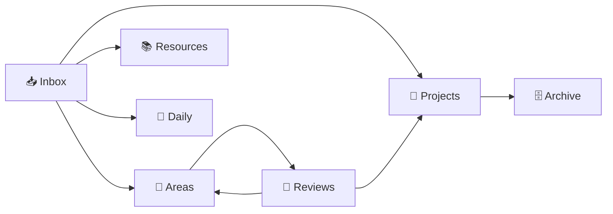

# 🧠 الدليل الرئيسي — Smart Menu Vault

## النظام

## اختصارات سريعة

| القسم | الرابط |
|-------|--------|
| 📥 صندوق الوارد | [[صندوق-الوارد]] |
| 📁 المشاريع | `1-📁 مشاريع-Projects/` |
| 📂 الأقسام | `2-📂 أقسام-Areas/` |
| 📚 الموارد | `3-📚 موارد-Resources/` |
| 📅 اليوميات | `5-📅 يوميات-Daily/` |
| 🗄 الأرشيف | `4-🗄 أرشيف-Archive/` |
| ⚡ التكاملات | `6-⚡ تكاملات-Integrations/` |
| 🔄 المراجعات | [[المراجعات-الدورية]] |
| 📊 لوحة التحكم | [[📊 لوحة-التحكم-Dashboard]] |

## قوانين الـ vault
1. **كلشي يدخل من Inbox** — unless you're in the middle of something and it's urgent
2. **Inbox يُفرغ أسبوعياً** — يوم الجمعة مع المراجعة
3. **كل note لها مكان واحد** — لا تكرر المحتوى (دوّن في مكان، اربط من كل مكان)
4. **Dataview يجمع** — ما تحتاج manual lists كتيرة
5. **المراجعة تغلق الدورة** — بدونها vault مجرد تخزين ميت

## التكاملات الحالية
- [[github-to-obsidian]] — سحب GitHub Issues
